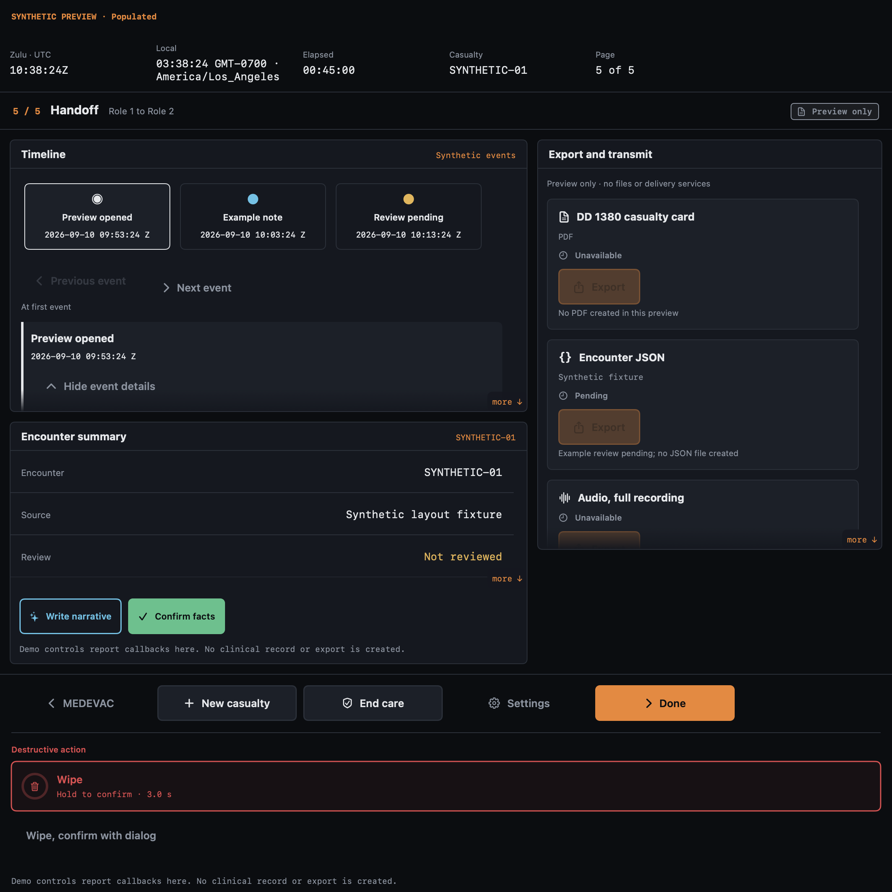
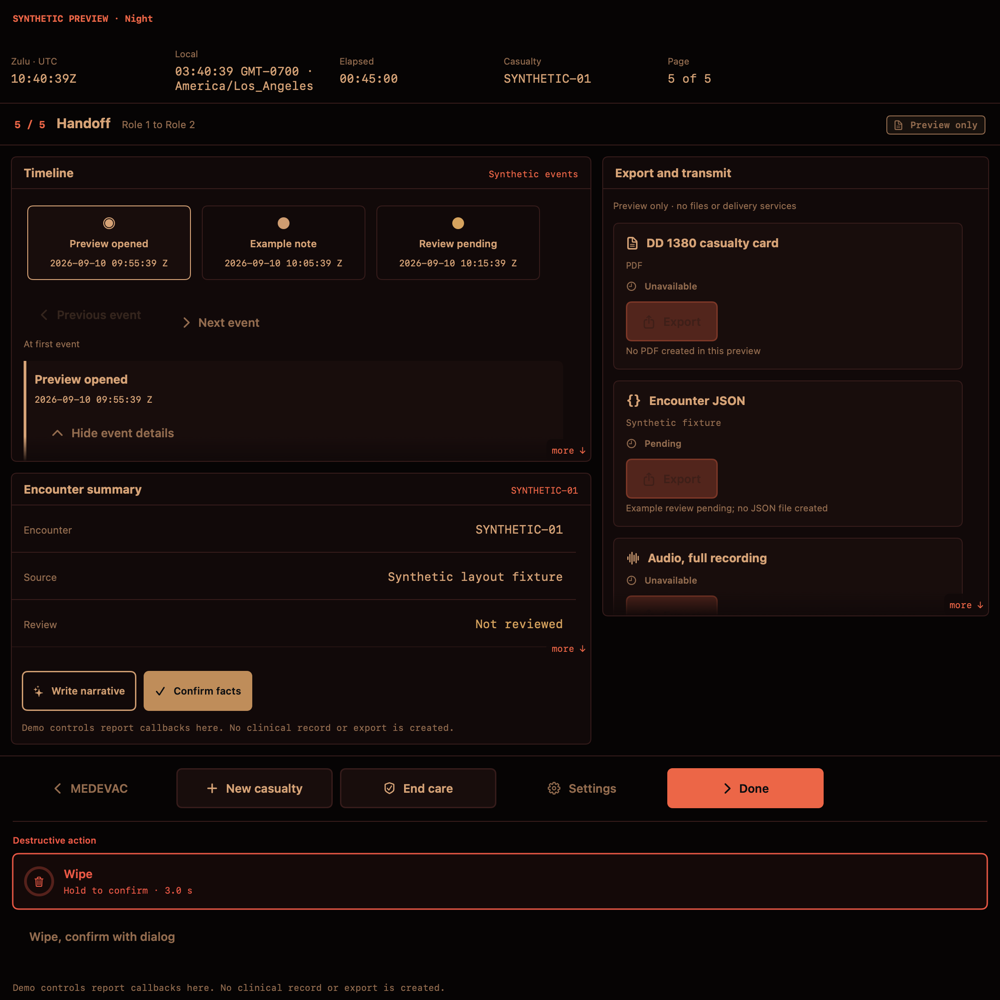

# SwiftUI reference port: isolated review

Source: `tccc-ui-kit.jsx`, supplied by the user on 2026-09-10. It is read as a design reference, not executed. The port lives in `Packages/TCCCDesignSystem`; no existing screen imports it and the app project is unchanged.

## Decisions before wiring

| Area | Translation and reason |
| --- | --- |
| Module | Standalone `TCCCDesignSystem` Swift package, not Apple UIKit or the existing app Theme. Integration needs explicit adapters/imports after review. |
| Theme | Preserve BASE/NIGHT token tables and semantic roles. Swap the injected Theme explicitly; do not auto-switch with ambient light or claim NVG certification. |
| Typography and targets | Native system/monospaced text with Dynamic Type. Small buttons retain 44pt targets; glove mode starts at 60pt. Rows begin at 52/64pt and can grow. Unknown/not-assessed text uses muted rather than the lower-contrast dim token, which remains available in the palette. |
| Missing data | Empty text explains what is missing. No assumed GPS accuracy, battery, casualty time, clinical status or exported file. |
| Hold confirmation | Native progress ring and haptic feedback. Early release, cancellation, disabled state and leaving the surface cancel the hold. Acceptance is not a claim that a wipe/transmission succeeded. Accessibility uses an explicit confirmation path. |
| Assessment | Whole-row three-state presentation remains; the caller owns clinical meaning, audit and persistence. A demonstration cycle cannot record a treatment. |
| Vital trends | Native drawing with safe empty/single-value data. A supplied reference band is visual context; this module neither diagnoses a trend nor invents normal ranges. |
| Body map | Correct the reference's posterior left/right mapping. Use labeled front/back regions and non-overlapping 44/60pt controls, allowing layout growth instead of small invisible hit areas. |
| Provenance | Show source spans and model confidence, but do not equate a high confidence score with human verification. |
| Radio | A visual read-along is not speech playback or transmission. Manual pacing is preferred; optional external actions require callbacks. Unavailable actions are disabled and explained. |
| Timeline and exports | Stable event identity and explicit readiness supplied by the caller. Empty/removal states must not index a missing event. Full file names remain available. |
| Composed handoff | Synthetic, preview-only two-column composition with timeline above summary and exports on the right. Adaptive single-column fallback supports larger text. No real encounter, file export or transmission. |

## Native review images

These are native SwiftUI/AppKit captures of the DEBUG-only composition, not web
mockups. Live clock text records the capture time; all encounter content is
explicitly synthetic. The toolbar uses a separate destructive-action group and
can take more vertical space than the reference's fixed footer. Layouts scroll
rather than compress touch targets or truncate content.





## Review scope

This pass ends at the reusable module and its previews. Existing clinical screens, model selection, storage and hardware behavior remain outside the port. Wiring any component into those paths is a separate step after reviewing these decisions.

## Component inventory

| Reference | Native port | Caller responsibility |
| --- | --- | --- |
| BASE / NIGHT | `Theme.base` / `.night`, `EnvironmentValues.tcccTheme`, `DesignMetrics` | Choose theme and glove mode explicitly. |
| Panel, SectionHeader, Row | Same native names | Supply labels and values; missing values stay unknown. |
| Pill | `Pill(state:text:)` | Supply status; no verification occurs here. |
| Button | `ActionButton` with all seven variants and three sizes | Provide action and availability reason. Destructive actions use the hold control. |
| Segmented | Typed options and selection binding | Supply unique option values and own the selection. |
| HoldToConfirm | Native ring, gesture lifecycle, sensory feedback, explicit confirmation alternative | Perform the requested operation and report its actual result separately. |
| StatusStrip | Native live timeline for UTC/local/elapsed | Supply encounter start and optional identity/device metadata. |
| ScrollFade | Real scroll geometry with conditional edge mask | Supply content and preferred viewport height. |
| AssessRow | Whole-row `AssessmentState` binding | Own clinical interpretation, audit and persistence. |
| VitalTrend | Native plot, timestamped samples, optional supplied band/status | Supply valid observations and clinical interpretation. |
| Timeline | Typed stable-ID events with expandable detail | Supply current events; selection is presentation state. |
| BodyMap | Typed front/back region marks and native figure | Own meaning and persistence of marks. |
| RadioScript | Manual visual read-along and optional external actions | Provide actual speech/radio services if desired later. |
| ExportCard | Explicit readiness and optional action | Create/share files and confirm outcomes outside the view. |
| Provenance | Source disclosure plus separate confidence and human verification | Supply source evidence and actual review state. |
| Toolbar | Adaptive navigation/actions with destructive hold | Supply navigation and lifecycle operations. |
| ComposedHandoff | DEBUG-only synthetic composition | Preview only; no application state or side effects. |

The palette, panel/row hierarchy, status vocabulary, button variants, selection
binding and assessment cycle translate directly. The other rows retain the
reference's purpose with the deliberate native decisions above. None of the
browser playground controls or CSS is embedded or executed.

## Opening previews

Open `Packages/TCCCDesignSystem/Package.swift` in Xcode and select its
`TCCCDesignSystem` scheme. Open a component source file and enable Canvas.
Each named `#Preview` includes Empty, Populated, Night, and Glove + large text
examples with explicit synthetic labels. Interactive examples use local state.
`ComposedHandoffPreview.swift` is the composed screen to review before any
integration. Preview types and fixtures compile only in DEBUG.

The library has no dependency on the application's similarly named components.
A future integration can use module-qualified names such as
`TCCCDesignSystem.Panel` and explicit adapters for domain state. It must not
infer persisted clinical actions from view state.

## Native API references

The port uses Apple [sensory feedback](https://developer.apple.com/documentation/swiftui/view/sensoryfeedback(_:trigger:)) and [scroll geometry](https://developer.apple.com/documentation/swiftui/scrollgeometry) APIs for native behavior.

## Delivery inventory and verification

The package is isolated from the clinical app and contains no third-party
runtime dependencies. CI now tests this package, compiles its release library,
and builds it for iOS Simulator separately from the existing app.

Native behavior evidence comes from a separate temporary simulator host at
`/private/tmp/tccc-design-system-preview-host`, bundle identifier
`com.aarzamen.TCCCDesignPreview`. It does not replace or link into the clinical
application. Its synthetic XCTest runs verify button geometry, assessment cycling,
early-release cancellation, long-hold single fire, release/rearm, movement
cancellation, and a 44-point requested scroll viewport enlarged for glove mode.
These checks do not establish physical glove usability, delivered haptics,
or a full VoiceOver/Switch Control walkthrough.

Final local checks, 2026-09-10:

- 18 package XCTest tests pass (4 theme/metrics, 7 behaviors, 7 data boundaries).
- Debug and release package builds pass; release object inspection shows no
  `ComposedHandoff`, `PreviewMatrix` or `PreviewScenario` implementation symbols.
- Independent standalone iOS Simulator build passes, using the same command as CI.
- All 9 isolated simulator UI tests pass, including the composition's empty
  action states and night/accessibility layouts. Final result:
  `/private/tmp/tccc-design-final-ui.xcresult`.
- Native SwiftUI/AppKit base and night composition captures are shown above.
- Four scoped/final independent source reviews are complete. Review findings
  fixed preview switch state and scroll viewport metrics; a failing equal-time
  trend regression was reproduced and corrected before the final passing suite.
- 19 named preview matrices cover every requested component. No changes to
  `TCCC_IOS/`, `project.yml`, the generated app project, or `Packages/TCCCKit`.

Reproduce the package checks from the repository root:

```bash
swift test --package-path Packages/TCCCDesignSystem
swift build --package-path Packages/TCCCDesignSystem --configuration release
cd Packages/TCCCDesignSystem
xcodebuild -scheme TCCCDesignSystem \
  -destination 'generic/platform=iOS Simulator' \
  -configuration Debug build CODE_SIGNING_ALLOWED=NO
```

The local agent environment required SwiftPM `--disable-sandbox` because nested
sandbox creation is unavailable; this does not change package code or CI.
There is no phone installation, clinical screen integration, device haptic
verification, full assistive-technology walkthrough, or physical glove trial in
this design-only delivery.
